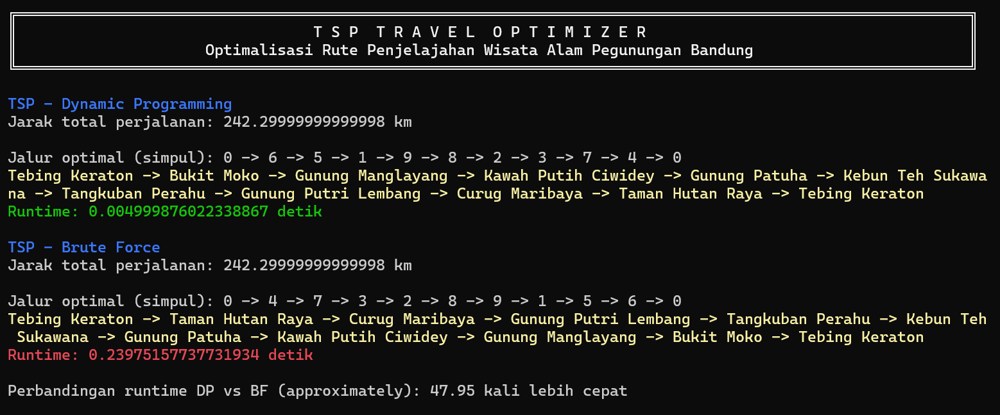

# TSP Travel Optimizer

> Tugas Makalah Matematika Diskrit 2024 - Andrew Tedjapratama 13523148

**TSP Travel Optimizer** adalah program Python untuk menyelesaikan masalah Travelling Salesman Problem (TSP) pada graf berbobot, dengan fokus pada rute optimal perjalanan wisata di kawasan Pegunungan Bandung. Program ini mengimplementasikan dua algoritma, yaitu **Dynamic Programming (DP)** dan membandingkannya dengan algoritma **Brute Force**, untuk menentukan jalur perjalanan terpendek dan mengevaluasi keunggulan efisiensi pendekatan **Dynamic Programming (DP)**

---



## Fitur

-   **Dynamic Programming**: Menggunakan algoritma Held-Karp untuk menyelesaikan TSP secara efisien pada dataset sedang hingga besar.
-   **Brute Force**: Mengevaluasi semua kemungkinan jalur untuk menemukan solusi optimal pada dataset kecil.
-   **Perbandingan Runtime**: Membandingkan kecepatan eksekusi kedua algoritma.
-   **Visualisasi Jalur**: Menyediakan output rute perjalanan optimal berdasarkan simpul dan nama lokasi wisata.

---

## Prerequisites

Pastikan Anda telah menginstall Python 3.6 atau versi lebih baru. Anda juga memerlukan beberapa pustaka berikut:

-   **NumPy**: Untuk operasi matematis pada matriks.
-   **itertools**: Library bawaan Python untuk menghasilkan permutasi.

Untuk menginstal NumPy, gunakan:

```bash
pip install numpy

```

## Cara penggunaan

```bash
git clone https://github.com/username/tsp-travel-optimizer.git
cd tsp-travel-optimizer
```

```bash
python main.py
```
